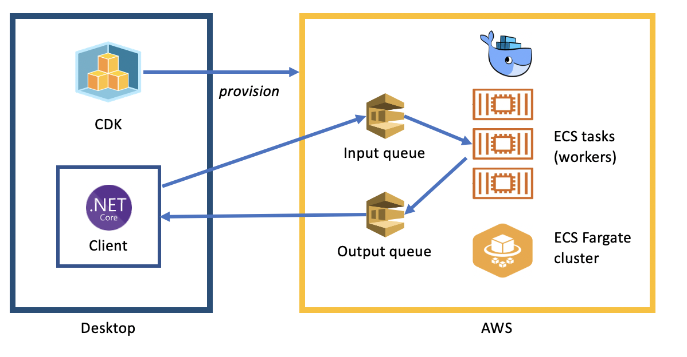

# Desktop HPC

This repository provides a sample implemnenation of desktop high performance Computing (HPC).  The use case is trivial, the goal is to find factors for a series of large (one trillion or larger) numbers.




## Building

The dotnet solution contains three projects:

* cdk - AWS CDK for building cloud infrastrocture
* client - client app to run on desktop
* worker - ECS task build as a docker container

To build the application, including the CDK and docker container:

```
dotnet publish -c Release
```

Bootstrap CDK (this is a one-time operation)

```
cdk bootstrap aws://ACCOUNT-NUMBER/REGION
```

Next, deploy the infrastructure to AWS:

```
cdk deploy --app "dotnet run --project CDK/CDK.csproj"
```

## Running

After a few minutes the ECS fargate cluster should be ready to use.  Run the client:

```
dotnet run --project Client
```

You will be prompted for a number of integers starting with one trillion one to factor.  Try entering "1000".

```
Input number of large integers to factor, starting with one trillion one:
100
Sending 100 numbers sent to cluster for factoring.
From 1000000000000000001 to 1000000000000000101
Results:
1000000000000000001 = 101 x 9901 x 999999000001
1000000000000000002 = 2 x 3 x 17 x 131 x 1427 x 52445056723
1000000000000000003 = 1000000000000000003
1000000000000000012 = 2 x 2 x 13 x 487 x 4623217 x 8541289
1000000000000000005 = 3 x 5 x 44087 x 691381 x 2187161
1000000000000000004 = 2 x 2 x 1801 x 246809 x 562425889
1000000000000000011 = 3 x 53 x 389 x 16167887342161
...

```

As this runs, watch the ECS console,  although you start with just one running task, after a few minutes you will see the task count scale up to five and the factors will start coming in faster.

Try running the client again with even more numbers to factor. When you are all done, remember to use cdk to destroy the cloud formation stack so you won't be chargged for a cluster you no longer need.

```
cdk destroy --app "dotnet run --project CDK/CDK.csproj" -f
```
